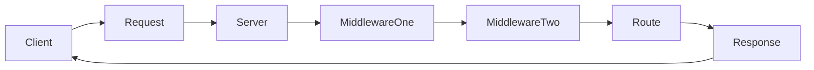

# ExpressJS Cheatsheet

ExpressJS is a backend NodeJS framework. Node has HTTP server functionalities built in but using them can be a little tricky and doing even the most basic things can be quite cumbersome, for example:

```js
// Import http library
const http = require("http")
// use env variable to define port with default
const PORT = process.env.PORT || 4000

//create our server object
const server = http.createServer()

// We define a function that runs in response to the request event
server.on("request", (request, response) => {
  // handle request based on method then URL
  switch (request.method) {
    case "GET":
      switch (request.url) {
        // response for unexpected get requests
        default:
          response.statusCode = 400
          response.write(`CANNOT GET ${request.url}`)
          response.end()
      }
      break

    case "POST":
      break

    case "PUT":
      break

    case "DELETE":
      break

    default:
      // Send response for requests with no other response
      response.statusCode = 400
      response.write("No Response")
      response.end()
  }
})

// get the server to start listening
server.listen(PORT, err => {
  // error checking
  err ? console.error(err) : console.log(`listening on port ${PORT}`)
})
```

To make writing http servers many minimalist frameworks were created:

- Express
- Koa
- Fastify
- Polka

On top of those frameworks more robust "batteries included" frameworks were created:

- nestjs
- foalts
- sails
- many more

## What is a backend framework?

A backend framework aids in building backend server application that:

- listen to incoming http requests on a tcp/ip port
- process the request through a chain of middleware
- send a response to the request

## Starting an express project

Must have NodeJS Installed to do the following.

- create empty folder
- open terminal in that folder
- create a new node project `npm init -y`
- install express `npm install express`

add some boiler plate code.

```js
// import the express library
const express = require("express")

// create an application object
const app = express()

// catch all route to response to all requests
app.get("*", (request, response) => {
  res.json({
  url: request.url,
  method: request.method,
  params: request.params,
  query: request.query,
  headers: request.headers
  })
})

// create a server listner
const PORT = process.env.PORT
app.listen(PORT, () => console.log(`Listening on port ${PORT}`))
```

## Basic Flow of an Express App



## Express Routing

Routes are functions that respond whether the incoming request is match based on the url path `/cheese` and the HTTP verb `GET/POST/PUT`.

You can register routes with the application either via the `app` object or creating a `router` object that will bundle a group of routes around a uniform path. Before we show the syntax for this let's discuss HTTP verbs.

There are several HTTP verbs although the vast majority of the time you'll only be using the following five:
- GET: used whenever your retrieving data
- POST: used to submit data to create a new thing
- PUT/PATCH: used to submit data to update a thing
- DELETE: used to delete a thing

The verbs have no intrinsic functionality, they are merely used as a way of categorizing intention of a particular request, so I could create a route for a delete request that adds data, but that'd be confusing and make it harder for other developers to understand your application.

Typically apps involve you working with different resources or models, for example `blog` in a blogging app. Usually routes are created in a particular pattern for all the main CRUD (Create Read Update Delete) action, this conventions is referred to as the RESTful routes.

| Route Name | HTTP Verb | PATH | Express Syntax | Purpose |
|------------|-----------|------|----------------|---------|
|Index|GET|`/blog`|`app.get("/blog", (req, res) => {...})`| Renders page with a list of blogs |
|Show|GET|`/blog/:id`|`app.get("/blog/:id", (req, res) => {...})`| Renders page with a single blog |
|Create|POST|`/blog`|`app.post("/blog", (req, res) => {...})`| Receives input, creates blog, redirects to index |
|New|GET|`/blog/new`|`app.get("/blog/new", (req, res) => {...})`| Renders page with form to create new blog |
|Update|PUT/PATCH|`/blog/:id`|`app.put("/blog/:id", (req, res) => {...})`| Receives input, updates blog, redirects to index |
|Edit|GET|`/blog`|`app.get("/blog/:id/edit", (req, res) => {...})`| Renders page with form to update a blog |
|Destroy|DELETE|`/blog/:id`|`app.delete("/blog/:id", (req, res) => {...})`| deletes blog, redirects to index |

### Routes using the app object

If you register a route with the app object it would look like this

```js
app.get("/cheese", (req, res) => {
  res.send("<h1>The Cheese Route</h1>")
})
```

This route will run if the request meets two criteria:
- The request is of method GET
- The path of the request is `/cheese` (user visited `localhost:3000/cheese`)

### Routes using Routers

You may have many routes that start with `/cheese`, so to save yourself some work you can create a router that handles all requests for /cheese, like so.

```js
// Create a router object
const CheeseRouter = express.Router()

// Register the router with the application for `/cheese` requests
app.use("/cheese", CheeseRouter)

// Register routes with the router
// get request for /cheese/one
CheeseRouter.get("/one", (req, res) => {...})
// get request for /cheese/two
CheeseRouter.get("/two", (req, res) => {...})
```

## The Request & Response Objects

Every route and middleware function receives the `request` and `response` object usually abbreviated as `req` and `res`. These objects have several useful properties, below is a few of them.

**THE REQUEST OBJECT**
- req.body: The data from the body of the request, requires bodyparsing middleware to be registered
- req.params: object with URL params if any are defined in the routes path such as `:id` would be `req.params.id`
- req.query: data from the query string if one exists so `?cheese=gouda` would be `req.query.cheese`
- req.headers: Object of all the headers in the request for example `req.headers.authorization`
- req.url: The url path
- req.method: the request method

**THE RESPONSE METHOD**
- res.send(): function for sending a string as a response
- res.json(): funciton to send an array or object as a JSON response
- res.render(): pull specified template from `views` folder and renders it with provided data using a [configured template engine (EJS, Pug, etc.)](https://main.grokoverflow.com/posts/2021/03-intro-to-express-templating-api-ejs)
- res.sendFile(): send a particular file as a response (easier to configure static middleware for this purpose)

## Middleware

Middleware are functions that will do something with the request and response objects then instead of sending a response like a route pass the request and response object to the next function in the chain which could either be more middleware or a route.

**Registering Middleware with the App which runs on every request**
```js
// registering middleware with the application
app.use((req, res, next) => {
  console.log(req.method, req.url)
  next() // move to next middleware
})
```

**Registering the Middleware with the App to only run for a certain path**
```js
// registering middleware with the application, but only for the path "/cheese"
app.use("/cheese", (req, res, next) => {
  console.log(req.method, req.url)
  next() // move to next middleware
})
```

**Registering the Middleware with A Router to only run for that routers routes**
```js
const router = express.Router()
app.use("/somepath", router)


// registering middleware with the application, but only for the path "/cheese"
router.use("/cheese", (req, res, next) => {
  console.log(req.method, req.url)
  next() // move to next middleware
})
```

**Registering the Middleware with An Individual Route**
```js
// save the middleware function in a variable (for clarity)
const myMiddleware = (req, res, next) => {
  console.log(req.method, req.url)
  next() // move to next middleware
}


// registering middleware with a route, can pass as many middleware as you want as long as the route is the last function
app.get("/cheese", myMiddleware, (req, res) => res.send("response") )
```

## Pre-Built Middleware

There is a lot of pre-existing middleware in the express library and middleware from other libraries, here we'll show some of the most popular ones.

**Built into express**
```js
app.use(express.static("public")) // serves files from a folder called "public" statically
app.use(express.urlencoded({extended: true}) // parses HTML form submissions so data is in req.body
app.use(express.json()) // parses JSON bodies and stores data in req.body
```

**Popular External Middleware**
Install
```
npm install cors morgan
```
register
```js
const cors = require("cors")
app.use(cors()) // configures cors headers for cross-site requests

const morgan = require("morgan")
app.use(morgan("tiny")) // logging request data
```
