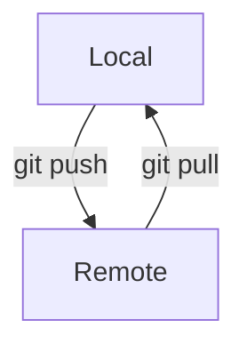
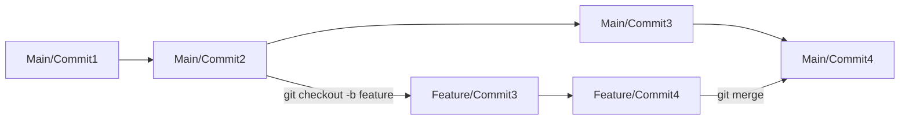

## Terminology

- a repo: a folder whose files and subfolders are being tracked in on commit chain

- staging: files that have been marked to be included in the next commit

- commit: a snapshot of files in the repo marking all changes in staged files since the last commit

- remote: a repo hosted elsewhere that receives commits from your local repo via pushes and can send your local repo commits via pull



## Creating a Repo

You have two options, from a folder that is not a repo (and ideally not a subfolder of an existing repo) you can create a fresh repo:

```
git init
```

You can also clone an existing repo from a remote location

```
git clone <URL>
```

If you clone, the remote repo you cloned from will automatically be a remote by the name of origin.

## Staging Files

In order to commit changes, the files to commit should be added to staging. You can always run a status check to see what files are staged to be committed and which are untracked.

```
git status
```

To add files to staging you can add an individual file

```
git add <filename>
```

Add everything in the current folder and subfolders

```
git add .
```

Add everything untracked in the whole repo (includes folder above and below current folder if part of same repo).

```
git add -A
```

removing files from staging follows the same patterns

```
git rm <filename> // single file
git rm . // current directory and subdirectories
```

## Comitting Changes

If you run `git commit` a text editor will open (VIM/NANO) to write a commit message. To avoid this type the commit message in line like so.

```
git commit -m "this is my commit message"
```

## Remote Repositories

Remote repositories are copies of the repo on other computers or other locations on the same computer. All you need is the location of the remote to configure your current repo to share commits with that remote.

```
git remote add <remotename> <remoteURL>
```

It is customary that the original repo be labeled as "origin" for the remote name.

To list all remotes that currently exist

```
git remote -v
```

To remove a remote
```
git remote rm <remotename>
```

## Sharing Commits

To send commits to a remote repository that has been added as a remote.

```
git push <remotename> <branch>

--example--
git push origin main
```

To receive commits a remote repo has your local repo doesn't

```
git pull <remotename> <branch>

--example--
git pull origin main
```

## Branches

Sometimes you plan on making changes your not sure you want in your main/master branch, so you can work in them in isolation in a branch which creates a divergent chain of commits.



Switching Branches

```
git checkout <branchname>
```

Create a new branch

```
git checkout -b <newbranchname>
```

merge target branch into current branch

```
git merge <targetbranchname>
```

List all branches and designate the current branch

```
git branch
```

create a new branch based on existing branch on a remote

```
git branch --track <remotename>/<branchname>

--example--
git branch --track origin/dev
```

## Merge Conflicts

When merging branches you may have a merge conflict and in the output it will tell you the exact file with the conflict:

```
CONFLICT (content): Merge conflict in merge.txt
```

If you open that file you'll see one or more instances of this:

```
<<<<<<< HEAD
this is some content to mess with
content to append
=======
totally different content to merge later
>>>>>>> new_branch_to_merge_later
```

The code between `<<<<<<< HEAD` and `=======` represent the original version of the code on your current branch.

The code between `=======` and `>>>>>>> new_branch_to_merge_later` is the incoming code from the branch you are merging in

Git doesn't know how to reconcile the two, so you need to edit to what you want the code to be then commit. When done there should be no more `<<<<<<< HEAD`, `=======`, and `>>>>>>> new_branch_to_merge_later` left in your file.
