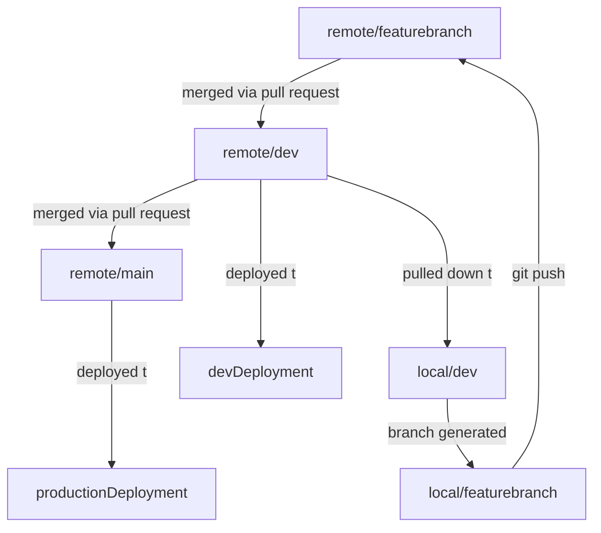

# Group Work Developer Guide

If your going to be working in a group to develop a small application, this guide will help walk your through the basic steps to get setup as a group for good progress as a group.

Some helpful videos:
- [Group Teamwork One - The Workflow](https://www.youtube.com/watch?v=llDIbfSrRB8)
- [Group Teamwork Two - Setup](https://www.youtube.com/watch?v=n1AfM6fuc9M)

## Step 1 - Planning

First thing is as a group you want to agree on several things:

1. What will be the project management tool: [Trello, Notion, Airtable, ClickUp, Asana are all great choices](https://www.youtube.com/watch?v=HFIhL_K2EWU&list=PLY6oTPmKnKbZ6P8tdFlrRAOTk6NUNjMMx)

2. Who is the team lead or "tech lead" this person will end up handling a lot of the initial setup, and overall management of the project. While they'll end up doing the least coding, they should be your strongest coder so they can clearly see the high level of the project and direct things and put out fires.

3. In your management tool, you should start setting up your tickets on your kanban board (3 columns, backlog/in progress/completed). The goal should be to move as much as possible from backlog -> completed. It's better to have more small tickets than broader many file tickets. If you have a larger task then it should be broken into multiple tickets for example.

- DOG API: Index Route
- DOG API: Show Route
- Dog API: Update Route

etc.

## Setup (The Tech Leads Part)

Goal is to setup all neccessary repos and deploy them, that way any future updates will be auto-deployed so you only have to focus on developing.

So for each leg of the project (example, express api and react frontend would be two legs each getting their own repo).

- Setup the most basic deployable version of the project, once it is all set then:
  - push up the main branch to github
  - create a dev branch `git checkout -b dev` and then push that up to github `git push origin dev`
  - with your host (heroku/render/railway for backend or vercel/netlify/render for frontend) deploy the main branch to `projectname.hostprovider.com`
  - then make a second deployment but this time deploy the dev branch and the url should be `projectname-dev.hostprovider.com`

The dev deployment is where you can see the progress in your application between less frequent merges into main.

Do this for all repo, likely two rounds, once for backend and then again from your frontend.

## Setup (team members part)

Once the tech lead has setup all repos there are two approaches:

- each member can be invited as a collaborator on the main repo
- each member can make their own fork of the original repo

If you are a collaborator, clone the original repo. (better choice if you are an actual team)
If you forked, then clone your fork, not the original repo. (better choice for external contributors to open source)

`git clone <url of repo>`

`cd` into the cloned project folder

make sure your on the main branch by running `git branch` which will list any branches and put an asterik next to the main branch. Now we want to make sure we have a local version of the existing `dev` branch so we will switch branches with instructions that the branch should track the remote `dev` branch.

```
git checkout --track origin/dev
```
This tells git "switch to a branch that tracks the branch called dev that should already exist on the remote repo called origin". (When you clone, the source repo will auto be under `origin`)

You are all setup.

## The Workflow

For each ticket you should strictly follow this work flow:

- Get assigned a ticket (a unit of work from the project management tool)
- Move ticket to in progress so everyone can see that's what your working on
- Make sure you are on the dev branch `git checkout dev`
- Make sure your dev branch is up to date `git pull origin dev` (pull any new commits to dev you don't have locally)
- Make a new branch for working on your ticket

If I were working on a new feature, let's say I'm building an Index API route for a Dog model, I'd call my branch `feature/dog-api-index` so the command would be `git checkout -b feature/dog-api-index` to create the branch.

If I were working on a bug fix, let's say fixing a broken show route for dog, the branch name would be `fix/dog-api-show` and the command would be `git checkout -b fix/dog-api-show`.

- `feature` means your adding functionality that did not exist prior
- `fix` means you are fixing existing functionality that isn't working right

Go branch naming makes it easier to find branches where particular work was done.

Once your branch is created locally, do the work to add the functionality. Ideally the tickets are setup in a way that only one person is working in the same file at a time (the more files you split your project into, the easier this is to do). Making sure only one person is working in any one file at a time will make merge conflicts rare and unlikely.

Once your done doing your work (make sure to commit regularly), then push the up the changes 

```
git push origin feature/dog-api-index
``` 

then visit the original repo and make a pull request where the base is the `dev` branch and the compare branch is your branch for your ticket. Once the pull request is made, notify the tech lead who should give a look (they should click on the pull request and click on changes to see the file changes layed out) and if it looks ok then accept the merge. The ticket is done, get a new assignment and start this whole process over again.

The tech lead after accepting the pull request should checkout the `dev` deployment to make sure there are no bugs, if so create a bug ticket and assign it to someone.

## When someone completes a ticket

To avoid merge conflicts or undoing someone elses work, you want to keep your branch in sync with changes in the `dev` branch. So whenever someone of the team has an accepted pull request, notify everyone and everyone should take a quick moment to do the following:

- commit your existing work
- switch back to dev `git checkout dev`
- pull changes `git pull origin dev`
- switch back to your working branch `git checkout feature/dog-api-index`
- merge the updates to dev into your working branch `git merge dev`

This may overwrite some of your work, but better than happens here then when pull into `dev`, this can be avoided if everyone is working in different files. The more you split your code into single purpose files, the less redoing of work is likely to happen.

## Public Releases

The deployment of the `main` branch is the version of the app you'd show the public so there should be a release schedule of when you'd make a pull request from `dev` into `main` which would pull all new updates into the production version of the codebase.



- remote: a branch of a repo on github
- local: a branch of a repo on your computer

## Other Tips

- Have daily standups (meet once a day and update on each other progress)
- have agreed upon communication channels, and clear stated availability
- leave code comments and good variable names to make code clear for team members
- If you need more than 2 lines for a comment create a markdown file in the same folder for details documentation, make sure to add a link to it from your readme.md
- Leaves not in your project management tool
- make a ticket in your project management tool to share .env variables key and values so everyone has consistent .env files (since these aren't on github)
